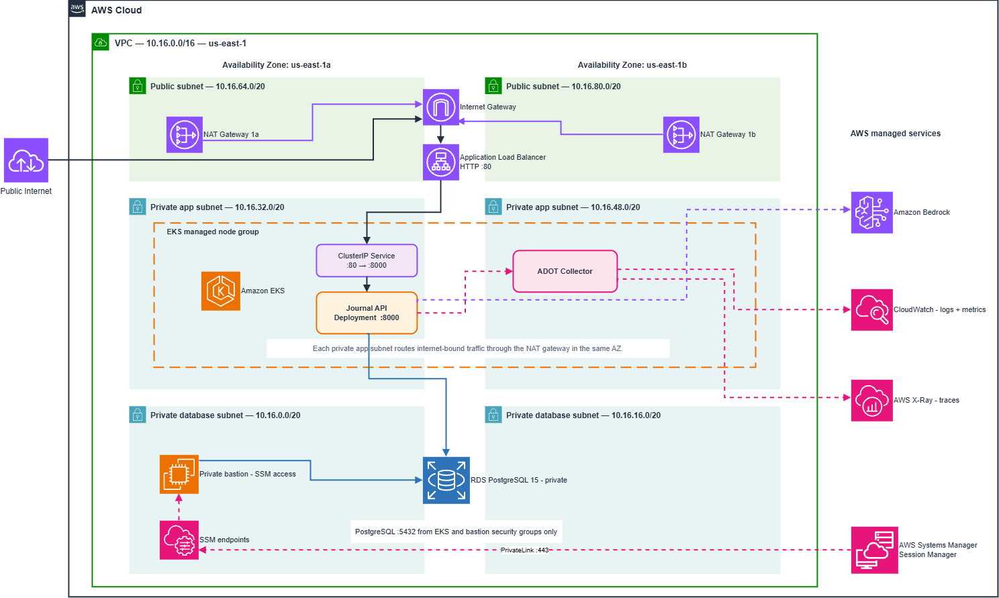

# 📘 Journal API on Amazon EKS

## 👨‍💻 About This Project

This project deploys a **FastAPI journal service to Amazon EKS** with PostgreSQL on Amazon RDS, AI-powered entry analysis through Amazon Bedrock, and OpenTelemetry observability through AWS Distro for OpenTelemetry (ADOT).

The architecture emphasizes private networking, IAM roles instead of static application credentials, repeatable infrastructure with Terraform, and automated delivery through GitHub Actions.

> **Cost warning:** This project creates billable AWS resources, including EKS, EC2, RDS, NAT Gateways, an Application Load Balancer, VPC endpoints, CloudWatch, and X-Ray. Follow [Teardown](#-teardown) when finished.

---

## 📑 Contents

- [Architecture Overview](#️-architecture-overview)
- [Project Summary](#-project-summary)
- [Network Design](#-network-design)
- [Security and Access](#-security-and-access)
- [API](#-api)
- [Deployment](#️-deployment)
- [CI/CD](#️-cicd)
- [Observability](#-observability)
- [Teardown](#-teardown)

---

## 🏗️ Architecture Overview



---

## 🚀 Project Summary

- **Application:** FastAPI running on a private EKS managed node group
- **Database:** Private Amazon RDS for PostgreSQL 15
- **Ingress:** Internet-facing Application Load Balancer
- **AI:** Amazon Bedrock accessed through IRSA
- **Observability:** OpenTelemetry data sent through ADOT to CloudWatch and X-Ray
- **Infrastructure:** Terraform-managed networking, compute, database, IAM, and security groups
- **Delivery:** GitHub Actions tests, builds, publishes, and deploys the application

---

## 🌐 Network Design

The `10.16.0.0/16` VPC spans two Availability Zones in `us-east-1`.

| Tier | `us-east-1a` | `us-east-1b` | Routing |
|---|---|---|---|
| Public | `10.16.64.0/20` | `10.16.80.0/20` | Internet Gateway |
| Private application | `10.16.32.0/20` | `10.16.48.0/20` | Same-AZ NAT Gateway |
| Private database | `10.16.0.0/20` | `10.16.16.0/20` | VPC-local only |

Each application subnet uses its own NAT Gateway. RDS and the bastion remain private, while the ALB is the public entry point for the API.

---

## 🔐 Security and Access

- EKS worker nodes and RDS have no public IP addresses.
- RDS accepts PostgreSQL traffic only from the EKS and bastion security groups.
- The bastion is reached through AWS Systems Manager Session Manager instead of SSH.
- The `ssm`, `ssmmessages`, and `ec2messages` VPC endpoints keep Session Manager traffic private.
- The Journal API, ADOT Collector, and AWS Load Balancer Controller use separate IRSA roles.
- Application secrets and Terraform variable values are excluded from Git.

---

## 🔌 API

| Method | Path | Purpose |
|---|---|---|
| `GET` | `/health` | Health check |
| `POST` | `/entries` | Create an entry |
| `GET` | `/entries` | List entries |
| `GET` | `/entries/{entry_id}` | Retrieve an entry |
| `PATCH` | `/entries/{entry_id}` | Update an entry |
| `DELETE` | `/entries/{entry_id}` | Delete an entry |
| `POST` | `/entries/{entry_id}/analyze` | Analyze an entry with Bedrock |

Swagger UI is available at `/docs`.

---

## ☁️ Deployment

### Prerequisites

Install and configure:

- AWS CLI and Session Manager plugin
- Terraform `>= 1.5.7`
- `kubectl`
- Helm
- Docker
- PostgreSQL client (`psql`)

Confirm that AWS CLI targets the intended account and `us-east-1`:

```bash
aws sts get-caller-identity
aws configure get region
```

### 1. Customize AWS account references

Replace account ID `021891619778` with your AWS account ID in:

- `infra/iam.tf`
- `k8s/journal-api-sa.yaml`
- `k8s/adot-collector.yaml`
- `k8s/cluster-addon/lb-controller-sa.yaml`

The IAM role names in Terraform must match the Kubernetes service-account annotations. The account must also contain the [`AWSLoadBalancerControllerIAMPolicy`](https://docs.aws.amazon.com/eks/latest/userguide/lbc-manifest.html) referenced by `infra/iam.tf`.

### 2. Configure Terraform

Create `infra/terraform.tfvars`:

```hcl
region        = "us-east-1"
cluster_name  = "journal-eks-cluster"
instance_type = "t3.micro"
db_username   = "journal_admin"
db_password   = "replace-with-a-strong-password"
db_name       = "journal_db"
```

Provision the infrastructure:

```bash
terraform -chdir=infra init
terraform -chdir=infra plan
terraform -chdir=infra apply
```

### 3. Configure EKS access

Grant your IAM user administrator access to the EKS cluster:

1. Open the **Amazon EKS console**.
2. Select **Clusters**, then select `journal-eks-cluster`.
3. Open the **Access** tab.
4. Under **IAM access entries**, select **Create access entry**.
5. For **IAM principal**, select the IAM user that will manage the cluster.
6. Leave **Type** set to **Standard**.
7. Select **Next**.
8. Under **Access policies**, select **AmazonEKSClusterAdminPolicy**.
9. Set **Access scope** to **Cluster**.
10. Select **Add policy**, then **Create**.

Configure `kubectl` using credentials for that IAM user:

```bash
aws eks update-kubeconfig \
  --region us-east-1 \
  --name "$(terraform -chdir=infra output -raw eks_cluster_name)"

kubectl get nodes
```

### 4. Install the AWS Load Balancer Controller

```bash
kubectl apply -f k8s/cluster-addon/lb-controller-sa.yaml

helm repo add eks https://aws.github.io/eks-charts
helm repo update

helm upgrade --install aws-load-balancer-controller \
  eks/aws-load-balancer-controller \
  --namespace kube-system \
  --set clusterName="$(terraform -chdir=infra output -raw eks_cluster_name)" \
  --set region=us-east-1 \
  --set vpcId="$(terraform -chdir=infra output -raw vpc_id)" \
  --set serviceAccount.create=false \
  --set serviceAccount.name=aws-load-balancer-controller
```

### 5. Initialize RDS through Session Manager

Start a private tunnel:

```bash
aws ssm start-session \
  --target <BASTION_INSTANCE_ID> \
  --document-name AWS-StartPortForwardingSessionToRemoteHost \
  --parameters '{
    "host":["<RDS_ENDPOINT>"],
    "portNumber":["5432"],
    "localPortNumber":["15432"]
  }' \
  --region us-east-1
```

With the tunnel running, initialize the database from another terminal:

```bash
PGPASSWORD='your-database-password' psql \
  -h 127.0.0.1 -p 15432 \
  -U journal_admin -d journal_db \
  -f database_setup.sql
```

### 6. Create the Kubernetes Secret

```bash
cp k8s/secrets.yaml.example k8s/secrets.yaml
```

Replace the placeholders in `k8s/secrets.yaml`, then apply it (Included it in .gitignore):

```bash
kubectl apply -f k8s/secrets.yaml
```

Use the private RDS endpoint in `DATABASE_URL`. Bedrock access uses IRSA, so static AWS credentials are not required in the Secret.

### 7. Deploy the application

The checked-in Deployment contains `IMAGE_PLACEHOLDER`. The GitHub Actions workflow replaces it with the immutable ECR image URI and applies the Kubernetes manifests when code is pushed to `main`.

After the workflow finishes:

```bash
kubectl rollout status deployment/journal-api -n default --timeout=5m

ALB_HOST=$(kubectl get ingress journal-api -n default \
  -o jsonpath='{.status.loadBalancer.ingress[0].hostname}')

curl "http://$ALB_HOST/health"
```

---

## ⚙️ CI/CD

Configure these GitHub Actions secrets:

| Secret | Purpose |
|---|---|
| `AWS_ACCESS_KEY_ID` | Authenticate to ECR and EKS |
| `AWS_SECRET_ACCESS_KEY` | Authenticate to ECR and EKS |
| `DB_USER` | CI PostgreSQL username |
| `DB_PASSWORD` | CI PostgreSQL password |

On every push to `main`, the workflow:

1. Runs Ruff and pytest against PostgreSQL 15.
2. Builds the Docker image and publishes it to ECR and GHCR.
3. Deploys the commit-specific ECR image to EKS.
4. Verifies the Kubernetes rollout.

---

## 📊 Observability

The Journal API exports traces, metrics, and logs to the ADOT Collector.

| Signal | AWS destination |
|---|---|
| Traces | AWS X-Ray |
| Metrics | CloudWatch namespace `JournalAPI` |
| Logs | CloudWatch Logs |

Custom telemetry includes the `journal.create_entry.database` span and the `journal.entries.created` counter.

---

## 🧹 Teardown

Delete the controller-managed ALB before destroying the infrastructure:

```bash
kubectl delete ingress journal-api -n default

terraform -chdir=infra plan -destroy -out=destroy.tfplan
terraform -chdir=infra apply destroy.tfplan
```

Confirm that the ECR repository is empty if Terraform reports that it cannot be deleted.
